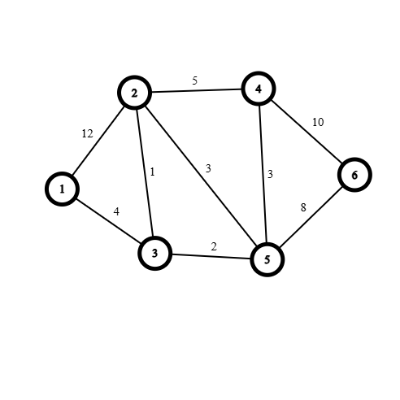

# PRIM

Tìm cây khung cực tiểu

Prim duy trì hai tập đỉnh `V: Đỉnh và Vmst : cạnh cực tiểu ` 

### Mã giả:

```cpp
Prim(u){
    //Bước 1: khởi tạo
    Vmst = {u}; // thêm đỉnh đầu tiên vào cây khung cực tiêu
    V = V \ {u};// Loại đỉnh u khỏi tập đỉnh ban đầu
    MST = Rỗng, d = 0;
    //Bước 2: Lặp
    while(v != empty()){
        e = (x,y); //Cạnh ngắn nhất x thuộc V, y thuộc Vmst
        MST = MST U (e);
        d = d + d(e);
        Vmst = Vmst U {x};
        V = V \ {x};
    }
}
```

Ví dụ cho đồ thị:



| Loop   | V           | V_MST     | e (x,y \| w min) | MST                           | d = d + d(e) | V_MST then  | V then  |
| ------ | ----------- | --------- | ---------------- | ----------------------------- | ------------ | ----------- | ------- |
| ~~~~   | 2,3,4,5,6   | 1         | 1,3 \| 4         | (1,3)                         | 4            | 1,3         | 2,4,5,6 |
| 1      | 2,4,5,6     | 1,3       | 3,2 \| 1         | (1,3),(2,3)                   | 5            | 1,3,2       | 4,5,6   |
| 2      | 4,5,6       | 1,3,2     | 3,5 \| 2         | (1,3),(2,3),(3,5)             | 7            | 1,3,2,5     | 4,6     |
| 3      | 4,6         | 1,3,2,5   | 4,5 \| 3         | (1,3),(2,3),(3,5),(4,5)       | 10           | 1,3,2,5,4   | 6       |
| 4      | 6           | 1,3,2,5,4 | 5,6 \| 8         | (1,3),(2,3),(3,5),(4,5),(5,6) | 18           | 1,3,2,5,4,6 | empty() |
| No Run | V = empty() |           |                  |                               |              |             |         |

### Mã tham khảo

```cpp
struct edge{ // Cấu trúc cho dữ liệu cạnh gồm 3 thuộc tính
    int u,v,w;
    edge(int _u,int _v,int _w){
        u = _u;
        v = _v;
        w = _w;
    }
};
int n,m; // n đỉnh và m cạnh
vector<pair<int,int>> adj[1001]; //Mảng lưu cạnh gồm đỉnh đầu, cuối và trọng số
bool used[1001]; // Đánh dấu đã được thêm vào V_MST chưa ?
vector<edge> MST; // Vector lưu cây khung cực tiểu
int d = 0; // Trọng số của khung tối giản
void primt(int u){
    used[u] = true; // Đánh dấu đã thêm đỉnh u vào trong V_MST
    while(MST.size()<n-1){ // Cây khung cực tiểu có số cạnh bằng số đỉnh trừ 1
        int min_w = INT_MAX; // Đánh mốc 
        int x,y; // Đỉnh đầu đỉnh cuối tạm thời
        for(int i = 1;i<=n;i++){ // duyệt tất cả các đỉnh
            if(used[i]){ // Kiểm tra đỉnh i có nằm trong V_MST không
                for(auto it : adj[i]){ // Có thì duyệt các đỉnh kề của đỉnh i
                    int v = it.first; // Lấy đỉnh kề 
                    int w = it.second; // Lấy trọng số
                    if(!used[v] && w < min_w ){ // Kiểm tra đỉnh kề có nằm ngoài V_MST không ?
                        min_w = w; // Đổi min
                        x = i;y = v; // Đổi giá trị biến
                    }
                }
            }
        }
        MST.push_back({x,y,min_w}); // Đẩy cạnh vào cây khung
        d += min_w; // Tính trọng số  của cây khung
        used[y] = true; // Đánh dấu đỉnh y đã được thêm vào MST
    }
}
void input(){
    cin>>n>>m;
    for(int i = 1;i<=m;i++){
        int u,v,w; cin>>u>>v>>w;
        adj[u].push_back({v,w});
        adj[v].push_back({u,w);
    }
    memset(used,false,sizeof(used));
}
```


